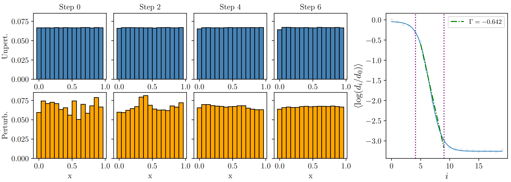

# Stochastic-dynamical-systems
This python library contains functions that helps compute the rate at which perturbations in the populations of different states of dynamical system whether deterministic or stochastic evolves with time. Specifically, it computes if the perturbation results in the system moving towards or away from the initial distribution and the rate at which this occurs.

### Evolution of perturbations in pure state vs mixed state

**(a)** Evolution of perturbations in the pure state of a tent map with $a=2$.  
Average rate at which perturbations evolve is obtained using Algorithm-1  

**(b)** Evolution of perturbations in the mixed state of a tent map with $a=2$.  
Average rate at which perturbations evolve is obtained using Algorithm-2  

# Algorithm: Computation of Average Rate of Perturbation Change for Mixed States

**Input:**
- Initial set of pure states $\{x^0_1, x^0_2, \dots, x^0_{N_s}\}$
- Number of samples $N_s$
- Number of bins $b$
- Perturbation amplitude $\epsilon$
- Dynamics $\mathcal{T}$
- Number of time steps $t$
- Number of trials $T$

---

**For $k = 0$ to $T-1$:**

1. Histogram the initial sample set into $b$ bins to obtain the unperturbed mixed state  
   $\mu(0)$, where $\sum_{n=1}^b \mu(\Delta_n, 0) = 1$  

2. Define perturbation:  
   $\delta \mu_n \sim \mathcal{N}(0, \epsilon), \quad n = 1, \dots, b$  

3. Perturbed unnormalized measure:  
   $\mu^*_{p,k}(\Delta_n) = \mu(\Delta_n, 0) + \delta \mu_n$  

4. Clip and renormalize:  
   $$\mu^{'}_{p,k}(\Delta_n) \leftarrow \max(\mu^{'}_{p,k}(\Delta_n), 0) $$
   $$\mu_{p,k}(\Delta_n, 0) = \dfrac{\mu^{'}_{p,k}(\Delta_n)}{\sum_{m=1}^b \mu^{'}_{p,k}(\Delta_m)}$  

5. Sample $N_s$ pure states from $\mu_{p,k}(0)$:  
   $\{x^0_{p,k,1}, \dots, x^0_{p,k,N_s}\} \subset \mathcal{X}$  

6. Compute initial Wasserstein distance:  
   $d_0^{(k)} = W_1(\mu(0), \mu_{p,k}(0))$  

---

**For $i = 1$ to $t$:**

a. Evolve both sets under $\mathcal{T}^i$:  
   $\{x^{(i)}_{k,1}, \dots, x^{(i)}_{k,N_s}\} = \{\mathcal{T}^i(x^0_1), \dots, \mathcal{T}^i(x^0_{N_s})\}\\  
   \{x^{(i)}_{p,k,1}, \dots, x^{(i)}_{p,k,N_s}\} = \{\mathcal{T}^i(x^0_{p,k,1}), \dots, \mathcal{T}^i(x^0_{p,k,N_s})\}$  

b. Construct histograms $\mu(i)$ and $\mu_{p,k}(i)$  

c. Compute Wasserstein distance:  
   $d_{i,k} = W_1(\mu(i), \mu_{p,k}(i))$  

d. Compute logarithmic growth ratio:  
   $\log \dfrac{d_{i,k}}{d_0^{(k)}}$  

---

**Update initial state:**  
$\{x^0_1, \dots, x^0_{N_s}\} \leftarrow \{x^{(t)}_{k,1}, \dots, x^{(t)}_{k,N_s}\}$  

---

**After trials ($k$ loop):**

For $i = 1$ to $t$:  
$\left\langle \log \dfrac{d_i}{d_0} \right\rangle = \dfrac{1}{T} \sum_{k=0}^{T-1} \log \dfrac{d_{i,k}}{d_0^{(k)}}$

---

**Output:**  
Array $\left\langle \log \dfrac{d_i}{d_0} \right\rangle$ for $i \in [1, t]$
