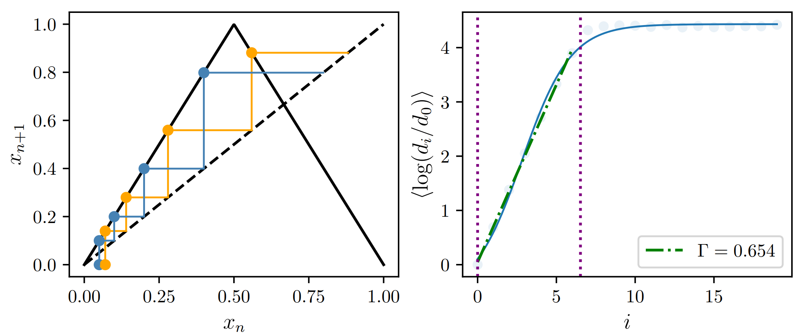

# Exploring global dynamics of stochastic and deterministic systems via perturbations of probability measures and optimal transport
This python library contains functions that helps compute the rate at which perturbations in the populations of different states of dynamical system whether deterministic or stochastic evolves with time. Specifically, it computes if the perturbation results in the system moving towards or away from the initial distribution and the rate at which this occurs.

# Γ-Based Sensitivity Analysis for 1D Dynamical Maps

This repository provides a modular framework for computing and visualizing **Γ (Gamma)** — the *average rate of ensemble separation*  
Γ serves as a measure-based analogue of the largest Lyapunov exponent (LLE), quantifying how probability ensembles evolve under perturbations rather than individual trajectories.

##  Overview

Traditional Lyapunov analysis captures the divergence of **single trajectories**, but it does not directly characterize how *ensembles of states* deform in probability space.  
Here, the Γ-measure quantifies the rate at which two initially close distributions diverge or converfe, using the **Earth Mover’s Distance (Wasserstein-1 metric)** between evolving ensembles.


###  Example : Evolution of perturbations in pure state(trajectory) vs mixed state(Statistical ensemble) tent map

**(a)** Evolution of perturbations in the pure state of a tent map with $a=2$.  
Average rate at which perturbations evolve is obtained using Algorithm-1  


**(b)** Evolution of perturbations in the mixed state of a tent map with $a=2$.  
Average rate at which perturbations evolve is obtained using Algorithm-2  


The codebase allows:
- Computation of Γ for deterministic or noisy maps.
- Parallelized evaluation of scaling behavior over parameters or noise levels.
- Visualization of ensemble divergence analogous to Lyapunov exponent plots.
---

## Repository Structure
```
├── Gamma.py # Core functions for computing Γ (ensemble separation rate)
├── Maps_1D.py # Clean, unified definitions of deterministic & noisy 1D maps
├── TM_Gamma.py # Example script: reproduces 'LLE_Distribution.pdf' for Tent Map (a = 2)
└── README.md # Project documentation

```
---

## ⚙️ Requirements

**Python ≥ 3.9**

Install dependencies:

```bash
pip install numpy matplotlib scipy POT joblib tqdm


